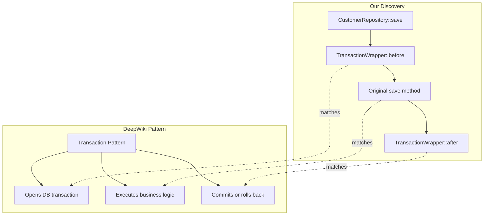

# DeepWiki Integration Strategy

**Resource**: https://deepwiki.com/magento/magento2  
**Purpose**: Cross-reference our graph data with official Magento 2 architecture documentation

---

## 🎯 What DeepWiki Provides

DeepWiki offers comprehensive architectural documentation for Magento 2, including:

### Content Types
- **Architectural Diagrams** (Mermaid format) - System layer visualizations
- **Source File References** - Links to actual GitHub repository code
- **Configuration Examples** - XML and JSON setup patterns
- **Dependency Tables** - Third-party packages and version constraints
- **Directory Structure** - Module organization patterns
- **Extension Mechanisms** - Plugins, observers, preferences explained

### Coverage Areas
1. **Module System** - Composer-based dependency management
2. **Dependency Injection** - Object lifecycle and plugin mechanisms
3. **Data Persistence** - Model-Resource-Collection patterns
4. **GraphQL APIs** - Schema definition and resolver implementation
5. **Admin Interface** - UI components and WYSIWYG editor
6. **Installation Systems** - Database schema management

---

## 💡 How Our Tool Complements DeepWiki

### Our Strength: Instance-Specific Analysis
- We parse YOUR actual Magento installation
- We discover YOUR custom plugins and observers
- We map YOUR module dependencies and relationships
- We show area-specific behavior (frontend vs admin vs REST API)

### DeepWiki's Strength: Canonical Documentation
- Official architectural patterns
- Best practices and design rationale
- Standard Magento core behavior
- Version-specific guidance (PHP 8.2-8.4, MySQL, Elasticsearch)

### Combined Power
Use our tool to discover what EXISTS in your installation, then use DeepWiki to understand WHY and HOW it should work.

---

## 🔗 Integration Opportunities

### 1. **Enrich Our Graph with DeepWiki Links**

Add DeepWiki documentation URLs to our nodes:

```json
{
  "id": "Magento\\Customer\\Api\\CustomerRepositoryInterface",
  "type": "Interface",
  "properties": {
    "name": "CustomerRepositoryInterface",
    "deepwiki_url": "https://deepwiki.com/magento/magento2/modules/customer/api",
    "description": "Service contract for customer data persistence"
  }
}
```

### 2. **Auto-Generate Documentation with Context**

When generating docs for a plugin, pull context from DeepWiki:

```markdown
## Plugin: TransactionWrapper

**Target**: CustomerRepositoryInterface  
**Sort Order**: -1 (runs first)  
**Class**: Magento\Customer\Model\Plugin\CustomerRepository\TransactionWrapper

### What Our Analysis Found
- Intercepts ALL methods on CustomerRepositoryInterface
- Runs before any other plugin (sortOrder: -1)
- Applied globally (all areas)

### DeepWiki Context
According to Magento 2 architecture docs:
- Transaction wrappers ensure database consistency
- Negative sortOrder ensures execution before business logic
- Plugin pattern allows extension without modifying core

**Reference**: https://deepwiki.com/magento/magento2/dependency-injection#plugins
```

### 3. **Validate Against Best Practices**

Compare our discovered patterns against DeepWiki standards:

```bash
# Our tool finds:
Plugin "customPaymentPlugin" on CheckoutRepository with sortOrder: 999

# DeepWiki says:
⚠️  Warning: sortOrder > 100 may indicate plugin chain fragility
📚 Best Practice: Use sortOrder 10-90 for normal plugins
🔗 Reference: https://deepwiki.com/magento/magento2/best-practices/plugins
```

### 4. **Mermaid Diagram Enhancement**

Our tool generates flowcharts, DeepWiki provides architectural context:



---

## 🛠️ Implementation Plan

### Phase 1: URL Mapping (Week 2)
Create mapping file linking Magento classes to DeepWiki URLs:

```json
{
  "Magento\\Customer\\Api\\CustomerRepositoryInterface": {
    "deepwiki_section": "modules/customer/api",
    "deepwiki_url": "https://deepwiki.com/magento/magento2/modules/customer/api"
  },
  "Magento\\Framework\\Model\\AbstractModel": {
    "deepwiki_section": "data-persistence/models",
    "deepwiki_url": "https://deepwiki.com/magento/magento2/data-persistence#models"
  }
}
```

### Phase 2: WebFetch Integration (Week 3)
Add DeepWiki scraping to parser:

```javascript
// In GraphBuilder.js
async enrichNodeWithDeepWiki(node) {
  const url = this.getDeepWikiUrl(node.id);
  if (url) {
    const docs = await fetchDeepWiki(url);
    node.properties.deepwiki_description = docs.summary;
    node.properties.deepwiki_diagram = docs.mermaid;
    node.properties.deepwiki_examples = docs.examples;
  }
}
```

### Phase 3: Enhanced Documentation (Week 4)
Generate comprehensive docs combining both sources:

```bash
npm start -- document Magento_Customer --with-deepwiki --output docs/
```

Produces:
```
docs/
├── Magento_Customer/
│   ├── overview.md (DeepWiki context + our findings)
│   ├── plugins.md (All discovered plugins with best practices)
│   ├── observers.md (Event flow with architectural rationale)
│   ├── diagrams/
│   │   ├── plugin-flow.mmd (Mermaid from our data)
│   │   └── architecture.mmd (Mermaid from DeepWiki)
│   └── api-reference.md (Service contracts)
```

---

## 🎯 Use Cases

### Use Case 1: Debugging Plugin Execution Order
```bash
# Developer: "Why is my plugin not running?"

# Our tool shows:
npm start -- plugins Magento\\Checkout\\Model\\Cart

# Output includes DeepWiki links:
Plugin: myCustomPlugin (sortOrder: 100)
⚠️  Note: 15 other plugins already registered
📚 DeepWiki: Plugin execution order explained
🔗 https://deepwiki.com/magento/magento2/dependency-injection#plugin-order
```

### Use Case 2: Understanding Event Flow
```bash
# Developer: "What happens when customer saves?"

# Our tool shows:
npm start -- observers customer_save_after_data_object

# Enhanced output:
Event: customer_save_after_data_object
Observers: 2 found

1. upgrade_order_customer_email
   Purpose: Syncs email to existing orders
   📚 Pattern: Data consistency observer
   🔗 https://deepwiki.com/magento/magento2/events#data-sync-pattern

2. upgrade_quote_customer_email
   Purpose: Syncs email to active quotes
   📚 Pattern: Data consistency observer
```

### Use Case 3: Anti-Pattern Detection
```bash
# Our analyzer finds:
⚠️  WARNING: 8 plugins on Magento\Catalog\Model\Product::save()
⚠️  WARNING: No transaction wrapper detected
⚠️  WARNING: Observer "sendEmailOnSave" performs HTTP request synchronously

📚 DeepWiki Recommendations:
- Limit plugins to 3-5 per method for maintainability
- Always wrap database operations in transactions
- Use message queue for slow operations in observers

🔗 https://deepwiki.com/magento/magento2/best-practices
```

---

## 📊 Data Enrichment Example

### Before (Our Current Output)
```json
{
  "id": "Magento\\Customer\\Api\\CustomerRepositoryInterface::transactionWrapper",
  "type": "Plugin",
  "properties": {
    "name": "transactionWrapper",
    "class": "Magento\\Customer\\Model\\Plugin\\CustomerRepository\\TransactionWrapper",
    "sortOrder": -1
  }
}
```

### After (With DeepWiki Integration)
```json
{
  "id": "Magento\\Customer\\Api\\CustomerRepositoryInterface::transactionWrapper",
  "type": "Plugin",
  "properties": {
    "name": "transactionWrapper",
    "class": "Magento\\Customer\\Model\\Plugin\\CustomerRepository\\TransactionWrapper",
    "sortOrder": -1,
    "deepwiki": {
      "pattern": "Transaction Wrapper Pattern",
      "purpose": "Ensures database operations are atomic",
      "best_practice": "Always use sortOrder < 0 for transaction wrappers",
      "reference_url": "https://deepwiki.com/magento/magento2/patterns/transaction-wrapper",
      "related_patterns": ["Unit of Work", "Database Transaction Management"]
    },
    "analysis": {
      "is_best_practice": true,
      "rationale": "Negative sortOrder ensures transaction opens before business logic"
    }
  }
}
```

---

## 🚀 Next Steps

1. **Create DeepWiki URL mapping** for common Magento namespaces
2. **Implement WebFetch integration** to pull documentation
3. **Add `--with-deepwiki` flag** to parse and document commands
4. **Generate enriched documentation** combining both sources
5. **Build anti-pattern detector** using DeepWiki best practices

---

## 📚 Resources

- **DeepWiki**: https://deepwiki.com/magento/magento2
- **Our Graph Data**: `data/Magento_Customer-graph.json`
- **Analysis**: `REAL_MODULE_ANALYSIS.md`

**This integration will transform our tool from a code mapper into a comprehensive Magento knowledge base.**
