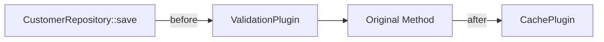

# Magento 2 Core Documentation & Mapping Tool

A Node.js utility that parses, analyzes, documents, and visualizes the Magento 2 core codebase to help developers understand how components interconnect, identify anti-patterns, and explore architectural relationships.

## 🎯 Project Status

**Current Phase**: Phase 0 - Planning Complete, Implementation Starting

**POC Target**: Magento_Customer module
**Timeline**: 4-week POC, then 5 phases over 18-21 weeks

See `magento-mapping-tool-project-plan.txt` for complete project roadmap.

## ✨ Features (Planned)

### Phase 1 POC (4 weeks)
- ✅ Parse Magento XML configuration (di.xml, events.xml, module.xml)
- ✅ Build in-memory graph of relationships
- ✅ CLI queries for plugins, observers, and dependencies
- ✅ Generate Mermaid diagrams

### Phase 2+ (Future)
- Neo4j graph database integration
- PHP method call chain analysis
- Interactive D3.js visualization
- Known issues/gotchas annotation system
- Community contribution workflow

## 🚀 Quick Start

### Prerequisites

- **Node.js** 18+ ([Download](https://nodejs.org/))
- **Docker** & **Docker Compose** ([Download](https://www.docker.com/products/docker-desktop))
- **Magento 2** installation (2.4.6+ recommended)

### Installation

1. **Clone or copy this directory to your machine**

   ```bash
   # If copying to a new machine, just copy the entire folder
   rsync -av /Volumes/External/magento-core/ /path/on/new/machine/
   ```

2. **Run setup script**

   ```bash
   cd magento-core
   ./scripts/setup.sh
   ```

   This will:
   - Check Node.js and Docker versions
   - Install npm dependencies
   - Guide you through configuration

3. **Configure environment**

   ```bash
   cp .env.example .env
   nano .env  # or use your preferred editor
   ```

   Set `MAGENTO_PATH` to your Magento installation:
   ```env
   MAGENTO_PATH=/Users/you/projects/magento2
   # or
   MAGENTO_PATH=./magento2  # if Magento is in this folder
   ```

4. **Start Docker services**

   ```bash
   npm run docker:up
   ```

   This starts:
   - **Neo4j** at http://localhost:7474 (user: neo4j, pass: magento-analyzer)
   - **PHP Parser** container with nikic/php-parser

5. **Verify setup**

   ```bash
   npm start -- init
   ```

## 📖 Usage

### Basic Commands

```bash
# Show help
npm start -- --help

# Parse a Magento module
npm start -- parse Magento_Customer

# Show plugins for an interface
npm start -- plugins CustomerRepositoryInterface

# Show observers for an event
npm start -- observers customer_save_after

# Show module dependencies
npm start -- deps Magento_Customer

# Generate diagram
npm start -- diagram CustomerRepository::save --output ./diagrams
```

### Docker Management

```bash
# Start all services
npm run docker:up

# Stop all services
npm run docker:down

# View logs
cd docker && docker-compose logs -f

# Access Neo4j browser
npm run neo4j:browser
# Or manually: open http://localhost:7474
```

### Development

```bash
# Install dependencies
npm install

# Run CLI in watch mode (auto-reload on changes)
npm run dev

# Run tests
npm test

# Run tests in watch mode
npm run test:watch

# Lint code
npm run lint
```

## 📁 Project Structure

```
magento-core/
├── src/
│   ├── cli/              # CLI entry point
│   │   └── index.js      # Command definitions
│   ├── parsers/          # Magento configuration parsers
│   │   ├── xml/          # di.xml, events.xml, module.xml parsers
│   │   └── php/          # PHP AST parser wrapper
│   ├── graph/            # Graph database logic
│   ├── commands/         # CLI command implementations
│   ├── analyzers/        # Analysis algorithms
│   └── visualizers/      # Diagram generators
├── tests/
│   └── fixtures/         # Test data
├── docker/
│   └── docker-compose.yml # Docker services definition
├── scripts/              # Helper scripts
│   ├── setup.sh          # Initial setup
│   ├── docker-up.sh      # Start services
│   └── docker-down.sh    # Stop services
├── data/                 # Parsed graph data (JSON)
├── diagrams/             # Generated diagrams
├── annotations/          # Known issues YAML files
├── schemas/              # JSON schemas
├── package.json          # Node.js dependencies
├── .env.example          # Environment template
└── README.md             # This file
```

## 🔧 Configuration

### Environment Variables (.env)

| Variable | Default | Description |
|----------|---------|-------------|
| `MAGENTO_PATH` | `./magento2` | Path to Magento 2 installation |
| `NEO4J_URI` | `bolt://localhost:7687` | Neo4j connection URI |
| `NEO4J_USER` | `neo4j` | Neo4j username |
| `NEO4J_PASSWORD` | `magento-analyzer` | Neo4j password |
| `NEO4J_HEAP_SIZE` | `2G` | Neo4j JVM heap size |
| `OUTPUT_DIR` | `./data` | Parsed data output directory |
| `DIAGRAMS_DIR` | `./diagrams` | Diagram output directory |

### Docker Services

The `docker-compose.yml` includes:

- **neo4j**: Graph database for storing relationships
- **php-parser**: PHP AST parser using nikic/php-parser
- **portainer** (optional): Docker management UI

To start only specific services:
```bash
cd docker
docker-compose up -d neo4j  # Only Neo4j
```

## 🎓 How It Works

### 1. Parsing Phase

The tool parses Magento XML configuration files:

```xml
<!-- di.xml -->
<preference for="CustomerRepositoryInterface" type="CustomerRepository" />
<plugin name="validate_customer" type="ValidationPlugin" sortOrder="10" />

<!-- events.xml -->
<event name="customer_save_after">
    <observer name="notify_customer" instance="NotificationObserver" />
</event>
```

### 2. Graph Building

Creates a graph representation:

```
Interface (CustomerRepositoryInterface)
  ↓ PREFERS
Class (CustomerRepository)
  ↓ INTERCEPTS (sortOrder: 10)
Plugin (ValidationPlugin)
```

### 3. Querying

Answers questions like:
- What plugins affect this method?
- What observers listen to this event?
- What modules does this depend on?

### 4. Visualization

Generates diagrams:



## 🎯 Phase 1 Goals (POC)

**Week 1-2**: XML Parsing
- Parse di.xml, events.xml, module.xml for Magento_Customer
- Build in-memory graph

**Week 3**: CLI & Queries
- Implement 3 core queries (plugins, observers, deps)
- Generate Mermaid diagrams

**Week 4**: Validation
- QA against known Magento structure
- GO/NO-GO decision for Phase 2

**Success Criteria**:
- Parse Magento_Customer in <5 minutes
- All 3 queries return correct results
- At least 1 diagram generated

## 🐛 Troubleshooting

### Docker not starting

```bash
# Check Docker is running
docker ps

# Check logs
cd docker && docker-compose logs

# Restart services
npm run docker:down
npm run docker:up
```

### Neo4j connection refused

```bash
# Wait for Neo4j to be ready (can take 30 seconds)
docker-compose logs neo4j

# Test connection
curl http://localhost:7474

# Access browser manually
open http://localhost:7474
```

### MAGENTO_PATH not found

```bash
# Verify path in .env
cat .env | grep MAGENTO_PATH

# Test path exists
ls $MAGENTO_PATH/vendor/magento/module-customer
```

### Permission denied on scripts

```bash
# Make scripts executable
chmod +x scripts/*.sh
```

## 📚 Documentation

- **magento-mapping-tool-project-plan.txt**: Complete 5-phase project plan
- **Neo4j Browser**: http://localhost:7474 (when running)

## 🤝 Contributing (Future)

Once Phase 3 is complete, contributions will be via:
- GitHub PRs for code
- YAML annotations for known issues
- JSON schema validation for quality

## 📝 License

MIT License - See LICENSE file for details

## 🔗 Related Tools

- **PHPStan Magento Extensions**: Static analysis
- **bin/magento dev:di:info**: Single class DI info
- **Magerun2**: CLI utilities
- **Magento DevDocs**: Official documentation

**Differentiation**: This tool provides visual relationship mapping, known gotcha detection, and interactive exploration that existing tools don't offer.

## 🗺️ Roadmap

- [x] Phase 0: Planning & Architecture (Complete)
- [ ] Phase 1: POC - Magento_Customer (4 weeks) ← **Current**
- [ ] Phase 2: Scale to Full Core + Neo4j (6 weeks)
- [ ] Phase 3: Known Issues Annotation System (3 weeks)
- [ ] Phase 4: Interactive Visualization UI (5 weeks)
- [ ] Phase 5: Launch & Hardening (3 weeks)

---

**Questions?** See the project plan for comprehensive roadmap.
