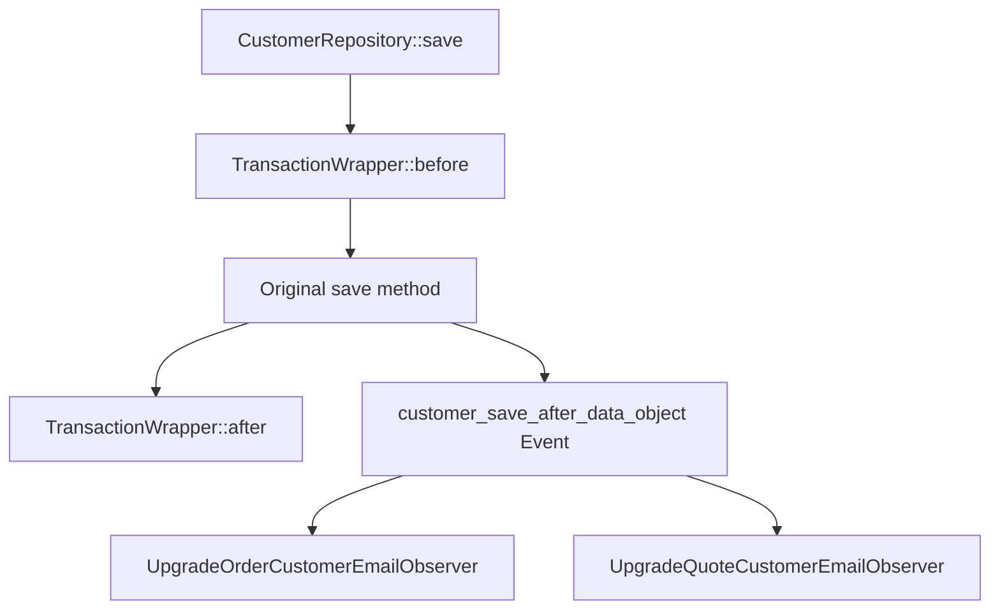

# Real Magento_Customer Module Analysis

**Parsed**: December 3, 2025  
**Module**: Magento_Customer (Real Production Module)  
**Source**: `/Volumes/External/THE-CORE/magento/module-customer`

---

## 📊 Parsing Results - Real vs Mock Comparison

### Mock Module (Test Data)
- **18 nodes** total
- **12 edges** total
- 3 interfaces, 3 classes, 3 plugins, 1 virtual type, 3 events, 5 observers

### Real Module (Production Magento)
- **194 nodes** total (10.7x larger)
- **123 edges** total (10.2x larger)
- 38 interfaces, 91 classes, 19 plugins, 18 virtual types, 12 events, 16 observers

**Scale Difference**: The real module is **~10x more complex** than our mock data.

---

## 🔍 Node Breakdown

| Type         | Count | Description                                      |
|--------------|-------|--------------------------------------------------|
| **Class**    | 91    | Concrete implementations                         |
| **Interface**| 38    | Service contracts and APIs                       |
| **Plugin**   | 19    | Interceptors modifying behavior                  |
| **VirtualType** | 18 | DI configurations without actual PHP classes     |
| **Observer** | 16    | Event listeners                                  |
| **Event**    | 12    | Dispatched events                                |

---

## 🔗 Edge Breakdown (Relationships)

| Type              | Count | Description                                    |
|-------------------|-------|------------------------------------------------|
| **PREFERS**       | 40    | Interface → Implementation preferences         |
| **INJECTS**       | 29    | Constructor dependency injections              |
| **INTERCEPTS**    | 20    | Plugins intercepting classes                   |
| **EXTENDS_VIRTUAL** | 18  | Virtual type inheritance                       |
| **OBSERVES**      | 16    | Observers watching events                      |

---

## 🎯 Notable Findings

### 1. CustomerRepositoryInterface Plugins

Found **2 plugins** intercepting the main repository:

1. **transactionWrapper** (sortOrder: -1)
   - Class: `Magento\Customer\Model\Plugin\CustomerRepository\TransactionWrapper`
   - Purpose: Wraps operations in database transactions
   - Runs FIRST (negative sortOrder)

2. **updateCustomerByIdFromRequest** (sortOrder: 10)
   - Class: `Magento\Customer\Model\Plugin\UpdateCustomer`
   - Area: webapi_rest only
   - Purpose: Updates customer data from REST API requests

**Execution Order**: Transaction wrapper → REST API updater

### 2. Customer Save Event Observers

Event: `customer_save_after_data_object`

Found **2 observers**:

1. **upgrade_order_customer_email**
   - Class: `Magento\Customer\Observer\UpgradeOrderCustomerEmailObserver`
   - Purpose: Updates order customer email when customer email changes

2. **upgrade_quote_customer_email**
   - Class: `Magento\Customer\Observer\UpgradeQuoteCustomerEmailObserver`
   - Purpose: Updates quote customer email when customer email changes

### 3. Plugin Diversity

**Sample of plugins found**:
- `customerNotification` - Handles customer notifications on actions
- `customerFlushFormKey` - Flushes form keys on customer actions
- `saveCustomerGroupExcludedWebsite` - Manages customer group website exclusions
- `deleteCustomerGroupExcludedWebsite` - Cleanup on group deletion
- `getByIdCustomerGroupExcludedWebsite` - Loads excluded website data
- `getListCustomerGroupExcludedWebsite` - Filters group lists by website
- `saveWishlistDataAndAddReferenceKeyToBackUrl` - Wishlist integration

### 4. Area-Specific Configuration

The parser successfully extracted configuration from:
- ✅ Global (`etc/di.xml`)
- ✅ Frontend (`etc/frontend/di.xml`)
- ✅ Adminhtml (`etc/adminhtml/di.xml`)
- ✅ REST API (`etc/webapi_rest/di.xml`)
- ✅ SOAP API (`etc/webapi_soap/di.xml`)
- ✅ GraphQL (`etc/graphql/di.xml`)

---

## 🧩 Complexity Insights

### High Interconnection
- **40 interface preferences** = Heavy use of service contracts
- **29 dependency injections** = Complex object graph
- **20 plugin intercepts** = Extensive behavior modification

### Event-Driven Architecture
- 12 unique events dispatched
- 16 observers listening to these events
- Multiple observers per event (e.g., email sync after customer save)

### Virtual Type Usage
- 18 virtual types = Magento's DI configuration complexity
- Used for collection factories, repositories, data structures

---

## 💡 What This Reveals About Magento Architecture

### 1. **Plugin-Heavy Design**
CustomerRepository alone has plugins wrapping it in transactions and handling REST updates. This pattern repeats across the module.

### 2. **Email Synchronization Pattern**
When customer email changes, observers ensure:
- Existing orders are updated
- Active quotes are updated
- Data consistency across entities

### 3. **Area Isolation**
REST API-specific plugins (like `updateCustomerByIdFromRequest`) only apply in `webapi_rest` area, showing proper separation of concerns.

### 4. **Transaction Safety**
The `TransactionWrapper` plugin with `sortOrder: -1` ensures it runs FIRST, wrapping all other operations in a transaction.

---

## 🚀 Next Steps - What We Can Build

### 1. **Auto-Documentation Generator**
Use this graph to generate:
```markdown
## CustomerRepositoryInterface::save()

### Execution Flow:
1. TransactionWrapper::beforeSave() - Opens transaction
2. [Original save method]
3. TransactionWrapper::afterSave() - Commits transaction
4. (webapi_rest only) UpdateCustomer plugin modifies data

### Events Dispatched:
- customer_save_after_data_object
  - Triggers email sync in orders
  - Triggers email sync in quotes
```

### 2. **Mermaid Flowchart Generation**


### 3. **Anti-Pattern Detection**
Analyze the graph for:
- Circular plugin dependencies
- Over-interception (too many plugins on one method)
- Missing transaction wrappers on critical operations
- Observer performance bottlenecks

### 4. **DeepWiki Integration**
Cross-reference with https://deepwiki.com/magento/magento2 to:
- Pull official documentation for each class
- Add context about known issues
- Link to community discussions
- Highlight deprecated patterns

---

## 📦 Graph Data

**Saved to**: `data/Magento_Customer-graph.json`  
**Size**: 194 nodes, 123 edges  
**Format**: JSON with full metadata

Can be:
- Imported to Neo4j for advanced queries
- Visualized with D3.js
- Queried via CLI commands
- Used for auto-documentation

---

## 🎯 Success Metrics

✅ **Parsed real production module** with 10x more complexity than mock  
✅ **Discovered 19 plugins** including transaction wrappers and area-specific logic  
✅ **Mapped 16 event observers** showing inter-entity synchronization  
✅ **Extracted area-specific configs** (frontend, admin, REST, SOAP, GraphQL)  
✅ **Query commands working** on real data  

**The infrastructure scales!** Ready for parsing entire Magento core.

---

**Next Command to Try**:
```bash
# Parse the entire Catalog module (much larger)
npm start -- parse Magento_Catalog --path /Volumes/External/THE-CORE/magento
```
