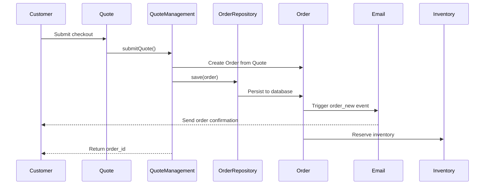
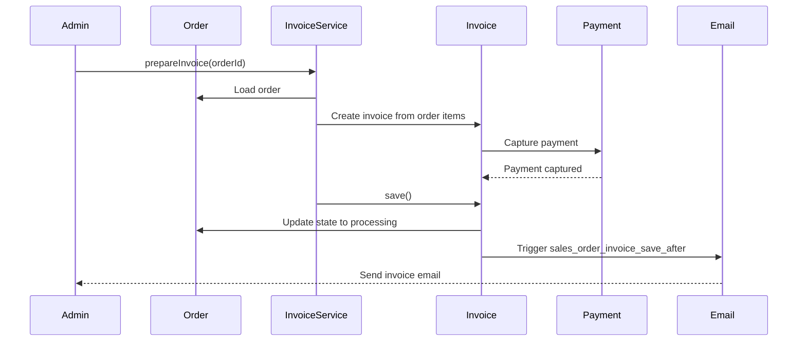
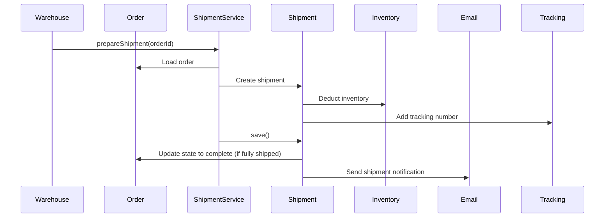
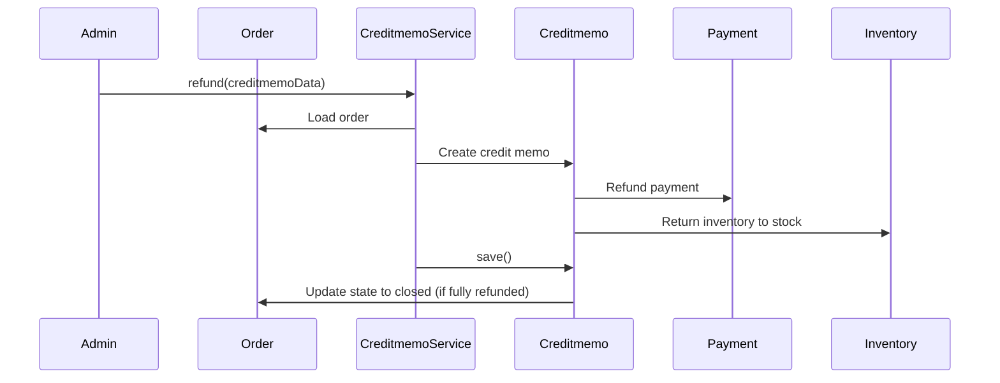

# Execution Flows - Magento_Sales

**Module**: Magento_Sales
**Version**: 2.4.x
**Last Updated**: 2025-12-04

This document details the critical execution flows for order management in the Magento_Sales module.

---

## Table of Contents

1. [Order Placement Flow (Quote → Order)](#1-order-placement-flow)
2. [Invoice Creation Flow](#2-invoice-creation-flow)
3. [Shipment Creation Flow](#3-shipment-creation-flow)
4. [Credit Memo Creation Flow](#4-credit-memo-creation-flow)
5. [Order Cancellation Flow](#5-order-cancellation-flow)
6. [Order State/Status Transition Flow](#6-order-statestatus-transition-flow)
7. [Email Notification Flow](#7-email-notification-flow)
8. [API Order Creation Flow](#8-api-order-creation-flow)

---

## 1. Order Placement Flow

**Purpose**: Convert a customer's shopping cart (Quote) into a confirmed Order.

### Entry Points

- **Frontend Checkout**: `Magento\Checkout\Model\Type\Onepage::saveOrder()`
- **Admin Order Create**: `Magento\Sales\Controller\Adminhtml\Order\Create\Save::execute()`
- **REST API**: `POST /V1/carts/mine/order`
- **GraphQL**: `mutation { placeOrder(input: {...}) }`

### Flow Diagram



### Detailed Steps

#### Step 1: Quote Submission
**Class**: `Magento\Quote\Model\QuoteManagement`
**Method**: `submit()`

```php
// vendor/magento/module-quote/Model/QuoteManagement.php:390
public function submit(QuoteEntity $quote, $orderData = [])
{
    // 1. Validate quote
    $this->validateQuote($quote);

    // 2. Trigger quote_submit_before event
    $this->eventManager->dispatch('checkout_submit_before', ['quote' => $quote]);

    // 3. Convert quote to order
    $order = $this->quoteToOrderConverter->convert($quote);

    // 4. Save order
    $order = $this->orderRepository->save($order);

    // 5. Trigger checkout_submit_all_after event
    $this->eventManager->dispatch('checkout_submit_all_after', ['order' => $order, 'quote' => $quote]);

    return $order->getId();
}
```

#### Step 2: Quote to Order Conversion
**Class**: `Magento\Quote\Model\Quote\Address\ToOrder`
**Method**: `convert()`

**Entities Created**:
- `sales_order` - Main order record
- `sales_order_item` - Order items from quote items
- `sales_order_address` - Billing/shipping addresses
- `sales_order_payment` - Payment information

```php
// Conversion logic
$order->setCustomerId($quote->getCustomerId());
$order->setCustomerEmail($quote->getCustomerEmail());
$order->setCustomerFirstname($quote->getCustomerFirstname());
$order->setGrandTotal($quote->getGrandTotal());
$order->setBaseGrandTotal($quote->getBaseGrandTotal());
```

#### Step 3: Order Persistence
**Class**: `Magento\Sales\Model\OrderRepository`
**Method**: `save()`

**Database Tables Updated**:
- `sales_order`
- `sales_order_grid` (for admin grid display)
- `sales_order_item`
- `sales_order_address`
- `sales_order_payment`
- `sales_order_status_history`

#### Step 4: Order State Initialization
**Initial State**: `new`
**Initial Status**: `pending`

```php
$order->setState(Order::STATE_NEW);
$order->setStatus($order->getConfig()->getStateDefaultStatus(Order::STATE_NEW));
```

#### Step 5: Event Triggers

**Events Dispatched**:
- `checkout_submit_before` - Before order creation
- `sales_model_service_quote_submit_before` - Quote submission
- `sales_model_service_quote_submit_success` - Order created successfully
- `checkout_submit_all_after` - After all processing complete

**Observers Listening**:
- Email notification observers
- Inventory reservation observers
- Analytics observers
- Custom third-party observers

### Code Example: Programmatic Order Creation

```php
<?php
use Magento\Quote\Api\CartManagementInterface;
use Magento\Quote\Api\CartRepositoryInterface;

class OrderCreator
{
    private CartManagementInterface $cartManagement;
    private CartRepositoryInterface $cartRepository;

    public function createOrder($customerId)
    {
        // 1. Load or create quote
        $cartId = $this->cartManagement->createEmptyCartForCustomer($customerId);
        $quote = $this->cartRepository->getActiveForCustomer($customerId);

        // 2. Add items, set addresses, payment, shipping
        // ... (quote configuration)

        // 3. Submit quote to create order
        $orderId = $this->cartManagement->placeOrder($cartId);

        return $orderId;
    }
}
```

### Common Issues

1. **Quote validation failures**: Missing required fields (email, address)
2. **Payment authorization failures**: Declined cards, gateway timeouts
3. **Inventory reservation failures**: Out of stock items
4. **Database deadlocks**: High concurrency during sales

---

## 2. Invoice Creation Flow

**Purpose**: Create an invoice to capture payment for an order.

### Entry Points

- **Admin**: `Magento\Sales\Controller\Adminhtml\Order\Invoice\Save::execute()`
- **REST API**: `POST /V1/order/{orderId}/invoice`
- **Programmatic**: `Magento\Sales\Model\Service\InvoiceService::prepareInvoice()`

### Flow Diagram



### Detailed Steps

#### Step 1: Invoice Preparation
**Class**: `Magento\Sales\Model\Service\InvoiceService`
**Method**: `prepareInvoice()`

```php
public function prepareInvoice(Order $order, array $qtys = [])
{
    // 1. Validate order can be invoiced
    if (!$order->canInvoice()) {
        throw new LocalizedException(__('The order does not allow an invoice to be created.'));
    }

    // 2. Create invoice
    $invoice = $this->orderConverter->toInvoice($order);

    // 3. Add items
    foreach ($order->getAllItems() as $orderItem) {
        $qty = isset($qtys[$orderItem->getId()]) ? $qtys[$orderItem->getId()] : $orderItem->getQtyToInvoice();
        $invoiceItem = $this->orderConverter->itemToInvoiceItem($orderItem);
        $invoiceItem->setQty($qty);
        $invoice->addItem($invoiceItem);
    }

    return $invoice;
}
```

#### Step 2: Payment Capture
**Class**: `Magento\Sales\Model\Order\Invoice`
**Method**: `pay()`

```php
public function pay()
{
    // Trigger payment capture
    $this->getOrder()->getPayment()->capture($this);

    return $this;
}
```

**Payment States**:
- Before: `pending`
- After: `paid`

#### Step 3: Order State Update

```php
// Order state transitions
STATE_NEW → STATE_PROCESSING (when first invoice created)
STATUS pending → STATUS processing
```

### Database Changes

**Tables Updated**:
- `sales_invoice` - Invoice record
- `sales_invoice_item` - Invoice items
- `sales_invoice_grid` - Admin grid
- `sales_order` - Order state/status updated
- `sales_order_payment` - Payment captured

### Events Triggered

- `sales_order_invoice_pay` - Before payment capture
- `sales_order_invoice_register` - Invoice registration
- `sales_order_invoice_save_after` - After invoice saved

---

## 3. Shipment Creation Flow

**Purpose**: Create a shipment to track order fulfillment.

### Entry Points

- **Admin**: `Magento\Shipping\Controller\Adminhtml\Order\Shipment\Save::execute()`
- **REST API**: `POST /V1/order/{orderId}/ship`
- **Programmatic**: `Magento\Shipping\Model\ShipmentNotifier`

### Flow Diagram



### Detailed Steps

#### Step 1: Shipment Preparation

```php
public function prepareShipment(Order $order, array $qtys = [])
{
    if (!$order->canShip()) {
        throw new LocalizedException(__('Cannot do shipment for the order.'));
    }

    $shipment = $this->converter->toShipment($order);

    foreach ($order->getAllItems() as $orderItem) {
        $qty = $qtys[$orderItem->getId()] ?? $orderItem->getQtyToShip();
        $shipmentItem = $this->converter->itemToShipmentItem($orderItem);
        $shipmentItem->setQty($qty);
        $shipment->addItem($shipmentItem);
    }

    return $shipment;
}
```

#### Step 2: Inventory Deduction

**MSI (Multi-Source Inventory)** integration:
- Inventory sources selected
- Stock deducted from source
- Inventory reservations cleared

#### Step 3: Order State Update

```php
// If all items shipped
STATE_PROCESSING → STATE_COMPLETE
STATUS processing → STATUS complete
```

### Database Changes

**Tables Updated**:
- `sales_shipment`
- `sales_shipment_item`
- `sales_shipment_track` (tracking numbers)
- `sales_shipment_grid`
- `sales_order` (state/status)

---

## 4. Credit Memo Creation Flow

**Purpose**: Process refunds and return inventory.

### Entry Points

- **Admin**: `Magento\Sales\Controller\Adminhtml\Order\Creditmemo\Save::execute()`
- **REST API**: `POST /V1/order/{orderId}/refund`

### Flow Diagram



### Detailed Steps

#### Step 1: Credit Memo Preparation

```php
public function prepareCreditmemo(Order $order, array $data = [])
{
    $creditmemo = $this->converter->toCreditmemo($order);

    // Set refund amounts
    $creditmemo->setGrandTotal($data['adjustment_positive'] - $data['adjustment_negative']);

    // Add items to refund
    foreach ($data['items'] as $itemId => $itemData) {
        $orderItem = $order->getItemById($itemId);
        $creditmemoItem = $this->converter->itemToCreditmemoItem($orderItem);
        $creditmemoItem->setQty($itemData['qty']);
        $creditmemo->addItem($creditmemoItem);
    }

    return $creditmemo;
}
```

#### Step 2: Payment Refund

```php
$creditmemo->refund(); // Triggers payment gateway refund
```

#### Step 3: Inventory Return

**Config**: `Stores > Configuration > Catalog > Inventory > Product Stock Options > Return Stock`

If enabled:
- Inventory returned to source
- Salable quantity increased

### Database Changes

**Tables Updated**:
- `sales_creditmemo`
- `sales_creditmemo_item`
- `sales_creditmemo_grid`
- `sales_order` (total_refunded, state/status)

---

## 5. Order Cancellation Flow

**Purpose**: Cancel an order and restore inventory.

### Entry Points

- **Admin**: `Magento\Sales\Controller\Adminhtml\Order::cancel()`
- **Frontend**: Customer cancels pending order
- **REST API**: `POST /V1/orders/{id}/cancel`

### Flow Steps

```php
public function cancel()
{
    // 1. Validate order can be cancelled
    if (!$this->canCancel()) {
        throw new LocalizedException(__('Cannot cancel this order.'));
    }

    // 2. Cancel order items
    foreach ($this->getAllItems() as $item) {
        $item->cancel();
    }

    // 3. Cancel payment
    $this->getPayment()->cancel();

    // 4. Update state
    $this->setState(Order::STATE_CANCELED);
    $this->setStatus(Order::STATUS_CANCELED);

    // 5. Trigger event
    $this->_eventManager->dispatch('order_cancel_after', ['order' => $this]);

    return $this;
}
```

### Inventory Restoration

- Inventory reservations released
- Stock returned to salable quantity

---

## 6. Order State/Status Transition Flow

**Purpose**: Understand order lifecycle and valid state transitions.

### State Machine

**States** (immutable system states):
- `new` - Order created, payment pending
- `pending_payment` - Awaiting payment authorization
- `processing` - Payment captured, fulfillment in progress
- `complete` - Fully shipped/delivered
- `closed` - Completed with refunds or cancelled with refunds
- `canceled` - Cancelled before fulfillment
- `holded` - On hold (manual admin action)

**Statuses** (customizable display labels):
- `pending` - New order, payment pending
- `processing` - Being processed
- `complete` - Completed
- `canceled` - Cancelled
- `on_hold` - On administrative hold
- Custom statuses can be created

### Valid Transitions

```
new → processing (invoice created)
new → canceled (order cancelled)
new → holded (admin holds)

processing → complete (fully shipped)
processing → closed (partial refund + closed)
processing → holded

holded → processing (admin releases)
holded → canceled

complete → closed (refund issued)
```

### Code Example: Custom Status

```php
// Create custom status
$status = $this->orderStatusFactory->create();
$status->setStatus('custom_pending_review');
$status->setLabel('Pending Review');
$status->assignState(Order::STATE_NEW, false);
$status->save();
```

---

## 7. Email Notification Flow

**Purpose**: Send transactional emails for order events.

### Email Types

1. **Order Confirmation** - `sales_email/order/enabled`
2. **Invoice** - `sales_email/invoice/enabled`
3. **Shipment** - `sales_email/shipment/enabled`
4. **Credit Memo** - `sales_email/creditmemo/enabled`

### Flow Steps

```php
// Email sender class
class OrderSender
{
    public function send(Order $order, $forceSyncMode = false)
    {
        // 1. Check if email enabled
        if (!$this->globalConfig->getValue('sales_email/order/enabled')) {
            return false;
        }

        // 2. Prepare variables
        $transport = [
            'order' => $order,
            'billing' => $order->getBillingAddress(),
            'payment_html' => $this->getPaymentHtml($order),
            'store' => $order->getStore(),
        ];

        // 3. Send email via transport
        $this->templateContainer->setTemplateVars($transport);
        $this->identityContainer->setCustomerEmail($order->getCustomerEmail());
        $this->transportBuilder->send();

        // 4. Mark as sent
        $order->setEmailSent(true);

        return true;
    }
}
```

### Email Templates

**Location**: `vendor/magento/module-sales/view/frontend/email/`

- `order_new.html` - Order confirmation
- `invoice_new.html` - Invoice notification
- `shipment_new.html` - Shipment tracking
- `creditmemo_new.html` - Refund notification

---

## 8. API Order Creation Flow

**Purpose**: Create orders programmatically via API.

### REST API Endpoint

**POST** `/V1/carts/mine/order`

**Request**:
```json
{
  "paymentMethod": {
    "method": "checkmo"
  }
}
```

**Response**:
```json
{
  "order_id": "000000123"
}
```

### GraphQL Mutation

```graphql
mutation {
  placeOrder(input: {
    cart_id: "xxxxxxxxxxx"
  }) {
    order {
      order_number
      order_id
    }
  }
}
```

### Authentication

**Customer Token**:
```bash
POST /V1/integration/customer/token
{
  "username": "customer@example.com",
  "password": "password123"
}
```

**Admin Token**:
```bash
POST /V1/integration/admin/token
{
  "username": "admin",
  "password": "admin123"
}
```

### Code Example: API Order Creation

```php
// Service contract approach
$cartManagement->placeOrder($cartId, $paymentMethod);
```

---

## Performance Considerations

### Order Grid Performance

**Issue**: Large order volumes slow down admin grid

**Solution**:
```sql
-- Add indexes
ALTER TABLE sales_order_grid ADD INDEX idx_customer_email (customer_email);
ALTER TABLE sales_order_grid ADD INDEX idx_created_at (created_at);
```

### Order Load Optimization

```php
// Use repository with field filtering
$searchCriteria = $this->searchCriteriaBuilder
    ->addFilter('increment_id', $orderNumber)
    ->create();

$orders = $this->orderRepository->getList($searchCriteria);
```

---

**Document Version**: 1.0.0
**Last Updated**: 2025-12-04
**Next**: See [PLUGINS_AND_OBSERVERS.md](./PLUGINS_AND_OBSERVERS.md) for detailed plugin documentation.
